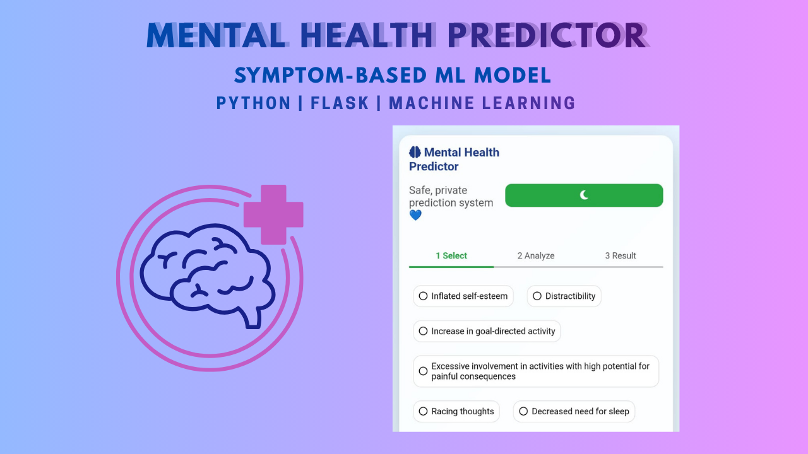

# 🧠 Mental Health Predictor

<p align="center">
  
</p>

##  Overview

A machine learning-based web application that predicts potential mental health disorders based on user-selected symptoms.  
The system analyzes symptom patterns and provides predictions through an interactive and user-friendly interface.

---

##  Features

- Predicts mental health disorders based on symptoms  
- Clean and simple user interface  
- Built with Flask for web deployment  
- Machine learning model for accurate predictions  
- Fast and responsive system  

---

##  Tech Stack

- Python  
- Flask  
- Machine Learning  
- Pandas / NumPy  
- HTML / CSS  

---

##  Live Demo

 https://shizwiz.pythonanywhere.com/

---

##  GitHub Repository

 https://github.com/shezzzz06/mental-health-predictor

---

##  Google Colab

 https://colab.research.google.com/drive/1ciGX8soZuxZ5Se6MDbthy0IYGFsKgq5J?usp=sharing

---

##  Screenshots

<p align="center">
  
</p>

<p align="center">
  
</p>
---

##  How to Run Locally

1. Clone the repository  
```bash
git clone https://github.com/shezzzz06/mental-health-predictor.git
